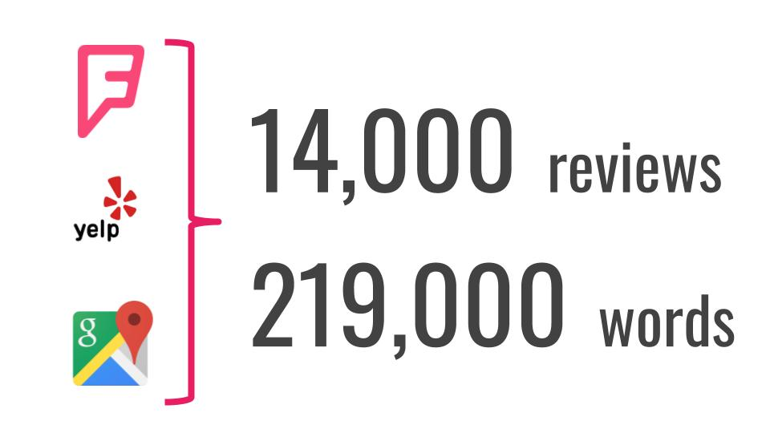
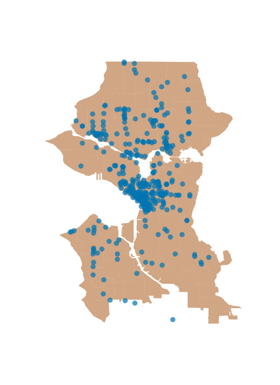
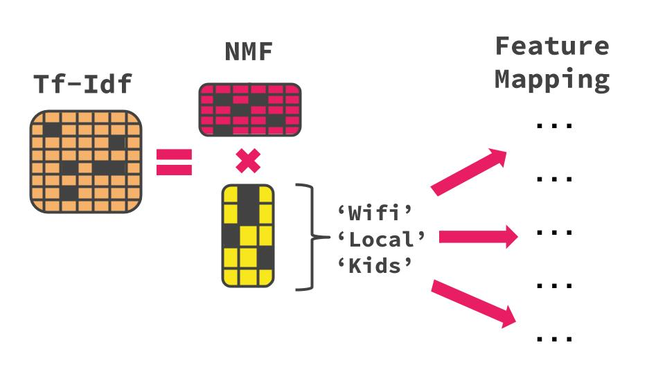
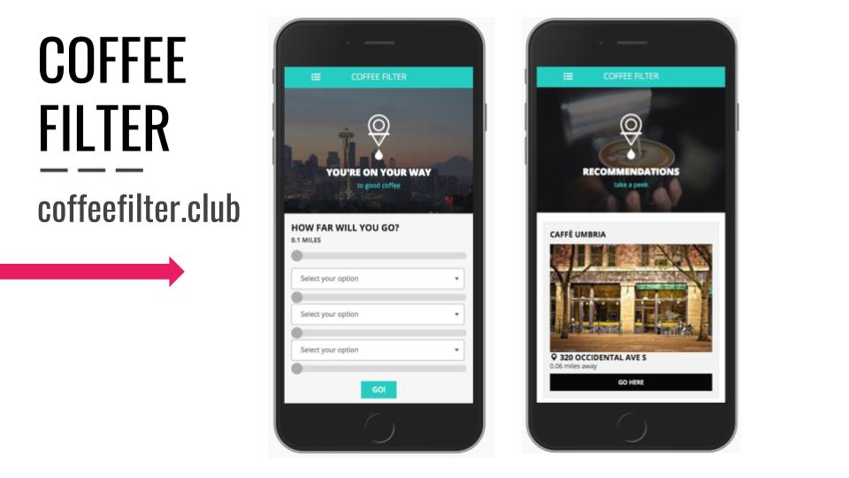
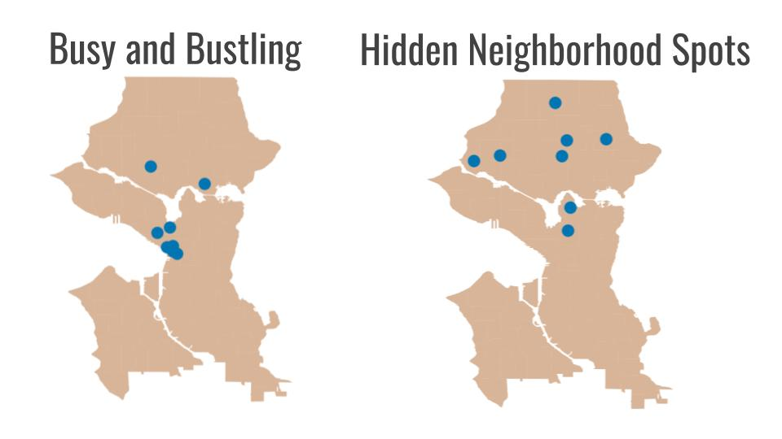
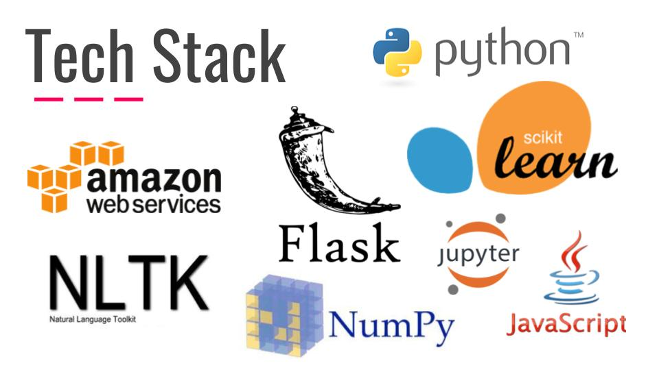

# [Coffee Filter](https://www.coffeefilter.club) -- Coffeeshop Recommender

## Project Motivation

As a Data Scientist living in Seattle, I share a common addiction with many other Seattleites -- Prolific coffee consumption. Every coffeeshop is unique and comes with its own distinct features. While sites like Yelp do a decent job of ranking these places, there is a gap in the market that could be filled by a more robust recommendation system.

## Goals

1. **Compile Coffeeshop Reviews** - Develop a data pipeline which pulls unique patron reviews from a diverse set of online sources
2. **Extract Latent Features** - Use Natural Language Processing techniques to extract hidden features from the text data of patron reviews
3. **Deploy a User-Facing Recommender** - Create a robust recommendation system that takes as input user location and desired features and outputs recommendations

## Data Collection

I focused my data collection on the APIs of Foursquare, Yelp, and Google Places. I wrote a number of functions in Python which pinged these interfaces and returned location ids, names, addresses, text reviews, images, etc. These functions can be found in the `API_functions` folder of this repo.

Due to limitations put in place by Foursquare, Google, and Yelp's APIs, I was unable to obtain a complete list of all coffeeshops in the city with one API request. Instead, I had to search by specific geographic coordinates and compile the list of coffeeshops myself.

Using coordinates obtained from [klokantech](http://boundingbox.klokantech.com/), I performed a grid search of geographic coordinates throughout the city of Seattle to obtain a database of all of the the venues classified as coffeeshops according to information pulled from Foursquare's API.

Once this list was cleaned and removed of duplicates, I used the Foursquare venue ids to obtain JSON files of all of the venue information including "tips", Foursquare's version of reviews.

Using names and addresses obtained from Foursquare' I pulled review data from Google's and Yelp's APIs. All review data from the three sources was then joined together with punctuation removed to aid in NLP processing.

## Data Preparation

Shops with the following attributes were removed from the dataset:
1. City was not Seattle - These snuck in the dataset due to the imprecise nature of gridsearching latitude and longitude coordinates
2. No reviews present - These appeared to be closed or incorrectly labeled as coffeeshops
3. Minimal reviews present - Given the lack of review data, I was not confident that my algorithm would accurately classify these shops
4. No addresses present - These also appears to be closed or incorrectly labeled

This resulted in a dataset of approximately 14,000 reviews and 219,000 words covering approximately 400 coffeeshops in the city.

## Model Pipeline

Using the data obtained above, I fit a Tf-Idf matrix using scikit-learn's implementation. As part of this process, I not only tokenized the text data, but also excluded a customized list of stopwords adapted from the NLTK library, including common words like “coffee”, “cafe”, “shop”, etc. which were unique to this project. Finally I passed the tokens through NLTK's WordNetLemmatizer to reduce inflectional forms and related wordings.

After experimenting with various numbers of features, I settled on a Tf-Idf with 500 features. From this I used a 40 component Non-Negative Matrix Factorization to extract latent features for each shop based on the content of the reviews.

Using the H and W matrices from the NMF model, as well as the vocabulary from the Tf-Idf model, I analyzed the most common words and the highest ranking shops for each latent feature to ascertain an understanding of the model's ability to correctly interpret the text reviews. A number of clearly defined categories of shops were coming to the surface. Top feature words like “Wifi”, “Local”, “Kids”, etc. pointed me in the right direction, but I didn’t feel that they were accurate enough for a user to interact with.  

It became apparent at this point that I needed to exclude Starbucks from the dataset. Given the high number of reviews for Starbucks locations as well as their prolific nature, they flooded the dataset and the recommendations, comprising over 15% of all coffeeshops in Seattle.

I used this information to build a mapping matrix, mapping my desired user-facing feature set to the latent features extracted by the NMF model.

## Recommender Implementation

The main functionality of the recommendation model was built into a class included in `recommender_model.py`.

On `init`, the model takes as input a DataFrame built with the NMF model's W matrix, as well as the mapping matrix referenced above.

When the `recommend` method is called, the following user information is fed to the recommender:
* The user's top three features along with their relative importances
* Current latitude and longitude
* Maximum range that the user is willing to travel
* Number of reviews to be output

The recommender then executes the `_map_features`, `_filter_by_lat_lng`, and `_sort_features` methods in order to comb through the data and output appropriate recommendations. Using Flask, AWS, Javascript, jquery, and CSS, this was packaged into a user-facing mobile website at [coffeefilter.club](https://www.coffeefilter.club).

## Evaluation

As unsupervised learning models are difficult to evaluate, I relied on my personal knowledge of Seattle coffeeshops as well as the feedback from other users to determine the accuracy of the model. Furthermore, I examined geographical plots of the top coffeeshops for each latent feature to check for intuitive accuracy.

As shows above, coffeeshops that score highly in the "Busy and Bustling" feature cluster in Seattle's downtown core whereas coffeeshops that score highly in the "Hidden Neighborhood Spots" feature cluster more in Seattle's more suburban neighborhoods to the North of downtown. Given my knowledge of the city, this makes logical sense, and the model appears to be predicting accurately. Additional plots are located in the `images` folder.

# Future Development
* Add a user feedback feature to allow users to react positively or negatively to their recommendations and further tune the latent features of the model
* Include data and recommendations for additional cities
* Incorporate shops with minimal reviews as a "Find me a random new place" feature
